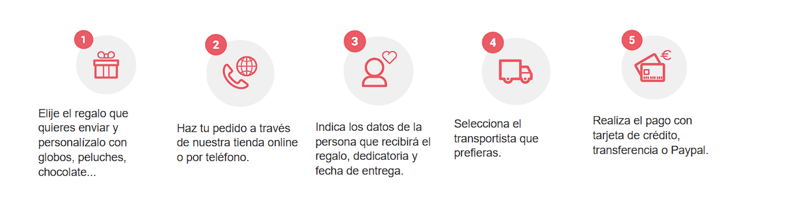
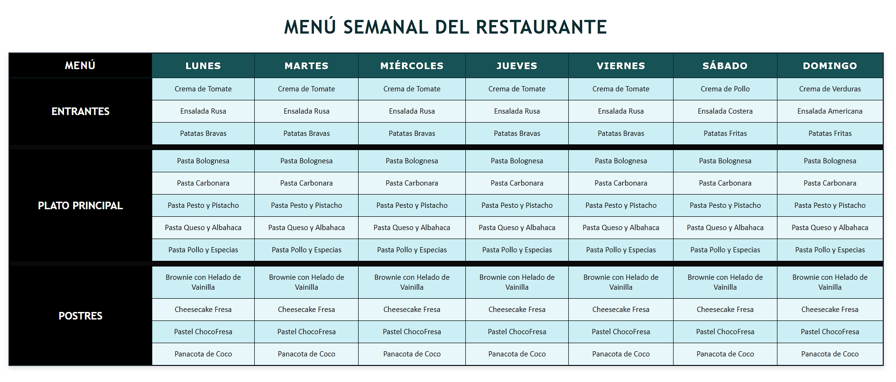

Cada carpeta representa una unidad didáctica (UD) del curso.  
Dentro de cada unidad se encuentran las actividades correspondientes, organizadas y documentadas individualmente.

---

## Descripción general

El repositorio tiene un propósito académico.  
Permite registrar los ejercicios realizados en clase, practicar el uso de GitHub y disponer de un espacio personal donde guardar ejemplos, apuntes y entregas.

Cuando una actividad genera un resultado visual (por ejemplo, una página HTML o un diseño replicado), se incluye una **captura de pantalla** dentro de la carpeta de dicha práctica, y se enlaza en este documento como referencia.

---

## Resultados visuales por unidad

### Unidad 2 – Tablas y Estilos CSS

#### Actividad 2 – Réplica de modelo HTML
Ejercicio de maquetación basado en una imagen proporcionada por el profesor, para practicar estructura y uso básico de etiquetas HTML.

**Resultado final:**

---

#### Actividad 3 – Menú Semanal de un Restaurante
Práctica centrada en el uso de tablas HTML con estilos CSS, aplicando propiedades de formato, alineación y color.  
El ejercicio consistía en diseñar un menú semanal con diferentes categorías (entrantes, plato principal y postres) y personalizar su estilo.

**Resultado final:**

---

## Tecnologías utilizadas

- **HTML5** – Estructura y contenido de las páginas  
- **CSS3** – Estilos, formato y presentación  
- **Visual Studio Code** – Editor principal de desarrollo  
- **SourceTree + GitHub** – Control de versiones y gestión de repositorios  

---

## Objetivo del repositorio

Este repositorio tiene como propósito:

1. Guardar y organizar todas las prácticas del módulo.  
2. Mostrar el progreso y aprendizaje a lo largo del curso.  
3. Familiarizarme con la documentación técnica en Markdown.  
4. Practicar el uso de herramientas profesionales como Git y GitHub.  

---

**Autora:** Francella Rojas Castillo  
**Centro:** Decroly, Santander (Cantabria)  
**Año académico:** 2025 – 2026
